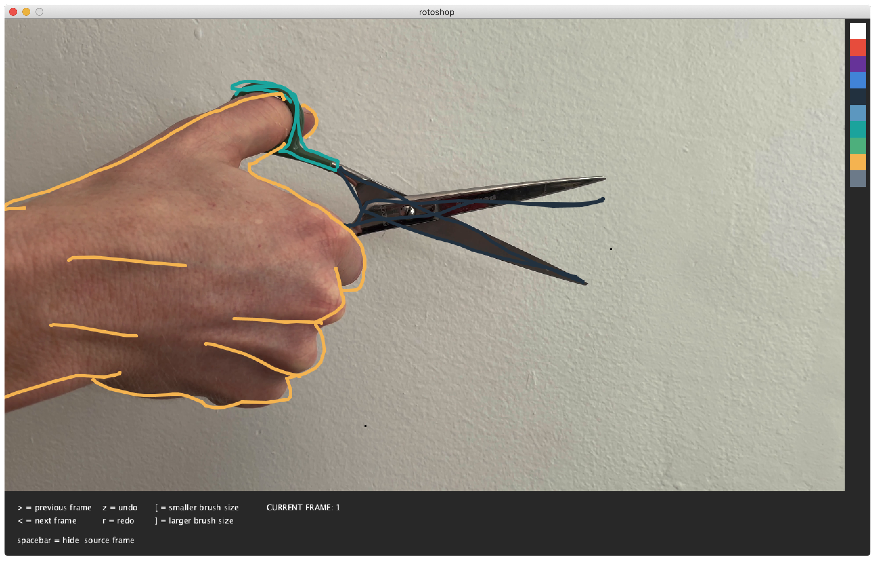

# UCLA DMA 172 Compressed Cinema
I wrote this rotoscoping program in Fall 2019 for Casey Reas' Compressed Cinema class at UCLA Design | Media Arts. I worked in collaboration with Jimmy Zhi, Stephen Heo, and Seenahm Suriyasat, who used the program to produce [this short animation film](https://www.youtube.com/watch?v=DCEJFAOLlxQ&t=15s). It based on the original [Rotoshop program by Bob Sabiston](https://en.wikipedia.org/wiki/Rotoshop), which was developed to accellerate production on the film A Scanner Darkly.

#### Utility
The original Rotoshop program is designed for digitally creating animation that preserves the autographic quality of the hand-drawn rotoscope technique. It interpolates between frames, which my version currently does not, although I remember adding frame interpolation for my classmates. Oh well, adding to the feature to-do list...

#### How to use
You will first have to extract image frames from the video you would like to rotoscope.
I have not yet included a script in this program to assist with that, so in lieu of that, I recommend you use ffmpeg.

``` ffmpeg -i example.mov -r 12 $example%03d.png ```

Make sure all your extracted image files are in the "input" folder.

To run the program, download Processing 3, which is what I used to write it.
Make sure to edit the code in lines 1 and 2, following the commented out instructions.
Then, you can run it! Happy rotoshopping! 

Once you hit the "run" button, the program should start and look something like this:



Your hand-drawn frames will save to the "output" folder. You can use ffmpeg again to stitch them back into a video format.

If you want a better colorpicker, you can replace the file "colors.png" in the data folder. Make sure it isn't wider than 25px, otherwise you'll have to resize the program window a bit, too. 
